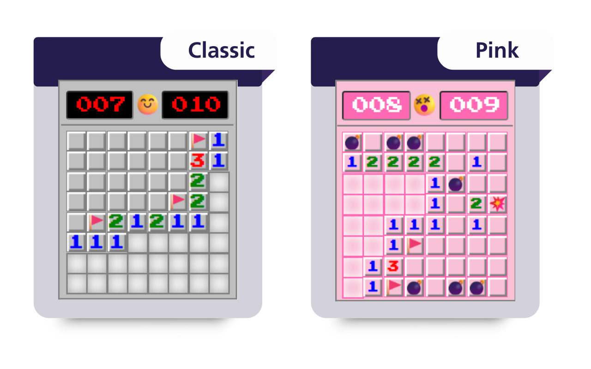

# Minesweeper Chrome Extension



Play the classic Minesweeper game directly in your browser! This extension allows you to enjoy the nostalgic puzzle game without leaving your browser.


## Installation Guide

**Clone the repository**:
   ```bash
   git clone https://github.com/your-username/minesweeper-extension.git
   cd minesweeper-extension
   ```

**Open Chrome and go to Extensions:**

1. Navigate to chrome://extensions in your Chrome browser.

2. Enable Developer Mode (toggle in the top-right corner).

**Load the extension:**

1. Click "Load unpacked".

2. Select the folder where you cloned the repository (minesweeper-extension).

**Let's play!**
